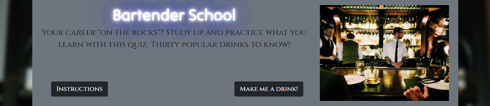
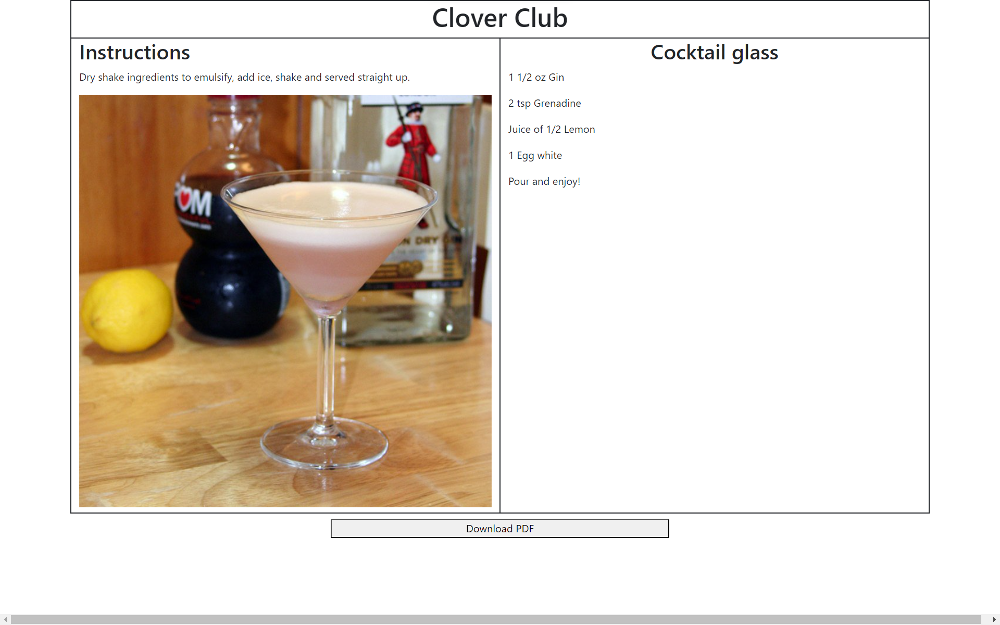

# Bartending School

## Description

Provide a short description explaining the what, why, and how of your project. Use the following questions as a guide:

- What was your motivation? This website was designed to teach anyone who wishes to become a bartender how to identify what ingredients go into each cocktail.
- Why did you build this project? (Note: the answer is not "Because it was a homework assignment.")

- What problem does it solve?
- What did you learn?

## Installation
This website reqiures an up to date web browser to run the application.

## Usage
Click on the date prompt to select your birthdate. Click on the instructions to view the instructions. Click on the **Make me a drink** button to view a random drink that the will need to be mixed by selecting the correct ingredients in the box of ingredients. Click on the **Mix it** button once ingredients have been selected. Click on the **Hint** button to view a hint stating the number of ingredients.  Once the correct ingredients have been selected and the **Mix it** button has been clicked the **Make a recipe card** button will appear.  

When the **Make a recipe card** button is clicked a printable recipe card for a drink.  When you click on the **Give up** button to add the drink to the list of mistakes. Click on the **Download PDF** button to download a recipe card.
Provide instructions and examples for use. Include screenshots as needed.

To add a screenshot, create an `assets/images` folder in your repository and upload your screenshot to it. Then, using the relative file path, add it to your README using the following syntax:

## Credits

List your collaborators, if any, with links to their GitHub profiles.

Special thanks to our contributers:
- Joe, [j-preim](https://github.com/j-preim)
- Kevin, [KDeLaria](https://github.com/KDeLaria)
- Pete, [petemaynard](https://github.com/petemaynard)
- Riley, [RB2277](https://github.com/RB2277)
- Tyler, [tylerpeterson8791](https://github.com/tylerpeterson8791)

If you used any third-party assets that require attribution, list the creators with links to their primary web presence in this section.

*“Picture of a bartenders” PxHere, *[pxhere.com/en/photo/1458811](https://pxhere.com/en/photo/1458811)*. Accessed 13 Jan. 2023.*

*“Picture of man pouring cocktails” PxHere, *[pxhere.com/en/photo/1529499](https://pxhere.com/en/photo/1529499)*. Accessed 13 Jan. 2023.*

*“Picture of a cocktail” PxHere, *[pxhere.com/en/photo/20464](https://pxhere.com/en/photo/20464)*. Accessed 13 Jan. 2023.*

*“Bartender waiting” PxHere, *[pxhere.com/en/photo/12762](https://pxhere.com/en/photo/12762)*. Accessed 13 Jan. 2023.*

*“Bartender double pour PxHere, *[pxhere.com/en/photo/1533591](https://pxhere.com/en/photo/1533591)*. Accessed 13 Jan. 2023.*

*“SAMSHSA Image” Substance Abuse and Mental Health Administration, *[samhsa.gov/find-help/national-helpline](https://www.samhsa.gov/find-help/national-helpline)*. Accessed 12 Jan. 2023.*

*The Cocktail DB API, *[www.thecocktaildb.com/api.php](https://www.thecocktaildb.com/api.php)*. Accessed 10 Jan. 2023.*

If you followed tutorials, include links to those here as well.

*“Immediate play sound on button click in HTML page” Stack Overflow, Paul, *[https://stackoverflow.com/questions/12953928/immediate-play-sound-on-button-click-in-html-page](https://stackoverflow.com/questions/12953928/immediate-play-sound-on-button-click-in-html-page)*. Accessed 13 Jan. 2023.*

## Features

If your project has a lot of features, list them here.
