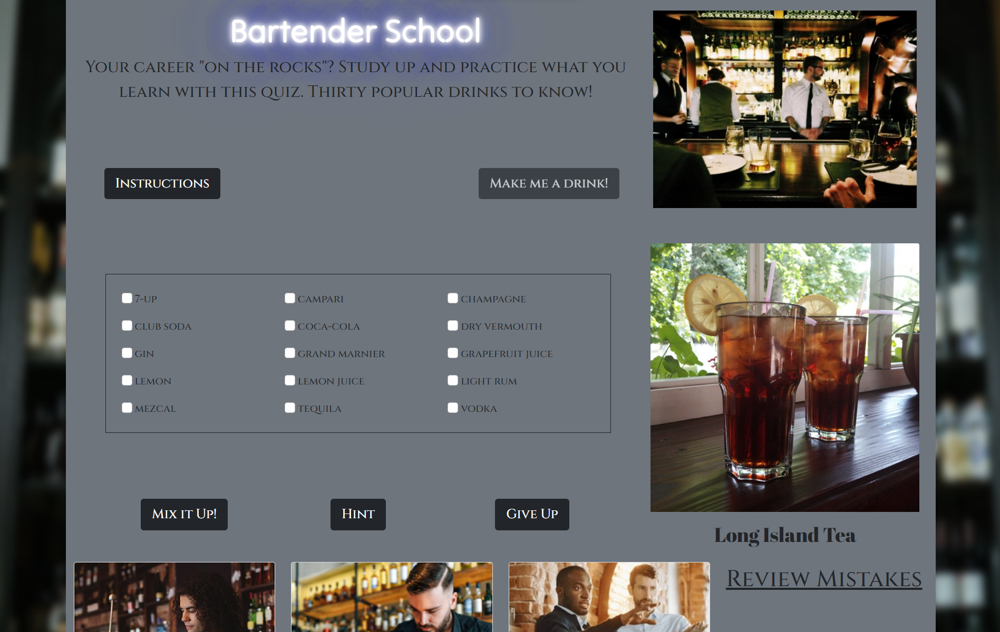

# Bartender School

Visit the [Bartending School](https://kdelaria.github.io/bartending-school/) webpage.

## Description 
This website was designed to teach everyone who wishes to learn how to identify the recipe of ingredients are used in various cocktails.

## Installation
This website reqiures an up to date web browser to run.

## Usage

Click on the date prompt to select your birthdate. Click on the instructions to view the instructions. Click on the **Make me a drink** button to view a random drink that the will need to be mixed by selecting the correct ingredients in the box of ingredients. Click on the **Mix it** button once ingredients have been selected. Click on the **Hint** button to view a hint stating the number of ingredients.  Once the correct ingredients have been selected and the **Mix it** button has been clicked the **View recipe** button will appear.

When the **View recipe** button is clicked a printable recipe card for a drink.  When you click on the **Give up** button to add the drink to the list of mistakes. Click on the **Download PDF** button to download a recipe card.

## Credits

Special thanks to our contributers:
- Joe, [j-preim](https://github.com/j-preim)
- Kevin, [KDeLaria](https://github.com/KDeLaria)
- Pete, [petemaynard](https://github.com/petemaynard)
- Riley, [RB2277](https://github.com/RB2277)
- Tyler, [tylerpeterson8791](https://github.com/tylerpeterson8791)

Resources:

*“Picture of a bartenders” PxHere, *[pxhere.com/en/photo/1458811](https://pxhere.com/en/photo/1458811)*. Accessed 13 Jan. 2023.*

*“Picture of man pouring cocktails” PxHere, *[pxhere.com/en/photo/1529499](https://pxhere.com/en/photo/1529499)*. Accessed 13 Jan. 2023.*

*“Cheers picture” Shutter Stock, *[shutterstock.com/image-photo/close-two-people-cheering-cocktails-bar-2293553721](https://www.shutterstock.com/image-photo/close-two-people-cheering-cocktails-bar-2293553721)*. Accessed 17 Jan. 2023.*

*“Bartender waiting” PxHere, *[pxhere.com/en/photo/12762](https://pxhere.com/en/photo/12762)*. Accessed 13 Jan. 2023.*

*“Bartender double pour” PxHere, *[pxhere.com/en/photo/1533591](https://pxhere.com/en/photo/1533591)*. Accessed 13 Jan. 2023.*

*“Barback picture” iStock, *[istockphoto.com/photo/young-waiter-cleaning-a-counter-gm677115854-124154071](https://www.istockphoto.com/photo/young-waiter-cleaning-a-counter-gm677115854-124154071)*. Accessed 11 Jan. 2023.*

*“Barback picture” iStock, *[istockphoto.com/photo/bartender-preparing-cocktails-gm1297673506-390747521](https://www.istockphoto.com/photo/bartender-preparing-cocktails-gm1297673506-390747521)*. Accessed 11 Jan. 2023.*

*“SAMSHSA Image” Substance Abuse and Mental Health Administration, *[samhsa.gov/find-help/national-helpline](https://www.samhsa.gov/find-help/national-helpline)*. Accessed 12 Jan. 2023.*

*The Cocktail DB API, *[www.thecocktaildb.com/api.php](https://www.thecocktaildb.com/api.php)*. Accessed 10 Jan. 2023.*

*“Immediate play sound on button click in HTML page” Stack Overflow, Paul, *[https://stackoverflow.com/questions/12953928/immediate-play-sound-on-button-click-in-html-page](https://stackoverflow.com/questions/12953928/immediate-play-sound-on-button-click-in-html-page)*. Accessed 13 Jan. 2023.*

*“Carousel” Bootstrap, *[getbootstrap.com/docs/5.3/components/carousel/](https://getbootstrap.com/docs/5.3/components/carousel/)*. Accessed 11 Jan. 2023.*